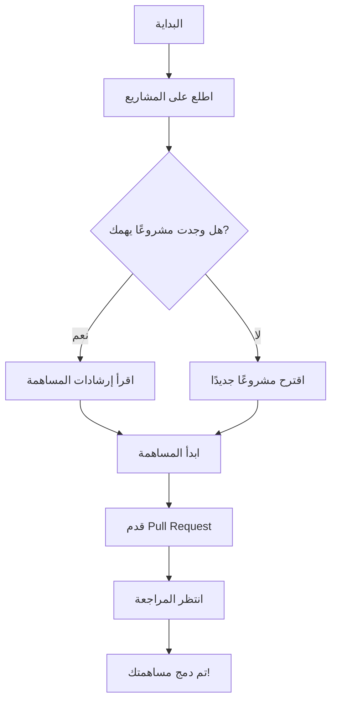

# 🌟 مجتمع مطوري جافا بالعربي | Arabic Java Developers Community 🌟

[🏠 الرئيسية](#مجتمع-مطوري-جافا-بالعربي--arabic-java-developers-community) | 
[👥 عن المجتمع](#-عن-المجتمع) | 
[🚀 ماذا نقدم](#-ماذا-نقدم) | 
[🤝 كيفية المشاركة](#-كيفية-المشاركة) | 
[📚 موارد](#-موارد) | 
[📞 تواصل معنا](#-تواصل-معنا)

---

## 👥 عن المجتمع

مرحبًا بكم في **مجتمع مطوري جافا بالعربي**! 🎉

نحن منصة تجمع المطورين العرب المهتمين بلغة Java وتقنياتها. هدفنا تعزيز ودعم مجتمع مطوري Java في العالم العربي من خلال:

- 🌱 تشجيع التعلم المستمر
- 🤝 تبادل المعرفة والخبرات
- 💡 تحفيز الابتكار في مجال تطوير Java
- 🌍 بناء شبكة قوية من المطورين العرب

## 🚀 ماذا نقدم

| 📂 مشاريع مفتوحة المصدر | 📚 محتوى تعليمي | 💪 تحديات وتمارين | 🎙️ ندوات وورش عمل | 🆘 دعم فني |
|:------------------------:|:----------------:|:------------------:|:-------------------:|:-----------:|
| شارك وتعلم من المشاريع الحقيقية | دروس، مقالات، وفيديوهات | اختبر مهاراتك وتطور | تعلم من الخبراء مباشرة | احصل على المساعدة عند الحاجة |

## 🤝 كيفية المشاركة

نرحب بمشاركتك الفعالة في المجتمع! إليك بعض الطرق للمساهمة:

1. 🐞 **حل المشكلات**: ابحث عن الـ Issues المفتوحة وساهم في حلها.
2. 💻 **اقتراح تحسينات**: قدم Pull Requests لتحسين الكود أو الوثائق.
3. 💬 **شارك في النقاشات**: انضم إلى محادثاتنا في قسم Discussions.
4. 📝 **شارك معرفتك**: اكتب مقالات أو دروس تعليمية للمجتمع.
5. 🙋 **ساعد الآخرين**: أجب على أسئلة المبتدئين وشارك خبراتك.

للبدء، اتبع هذه الخطوات:

## 📚 موارد

استفد من مجموعتنا الغنية من الموارد التعليمية:

- [📘 وثائق Java الرسمية](https://docs.oracle.com/en/java/)
- [🧰 أدوات ومكتبات مفيدة](https://github.com/u4java/u4java/blob/main/java-tools-libraries.md)
- [📖 كتب موصى بها](https://github.com/u4java/u4java/blob/main/recommended-java-books.md)
- [🎓 دورات مجانية](https://github.com/u4java/u4java/blob/main/free-java-courses.md)
- [🏆 تحديات برمجية](https://github.com/u4java/u4java/blob/main/java-coding-challenges.md)

## 📞 تواصل معنا

---

### 💖 شكر خاص لجميع المساهمين والداعمين لمجتمعنا! 💖

---

🌟 معًا نبني مستقبل أفضل لتطوير Java في العالم العربي! 🌟

 [القواعد](https://github.com/u4java/u4java/blob/main/CODE_OF_CONDUCT.md)

